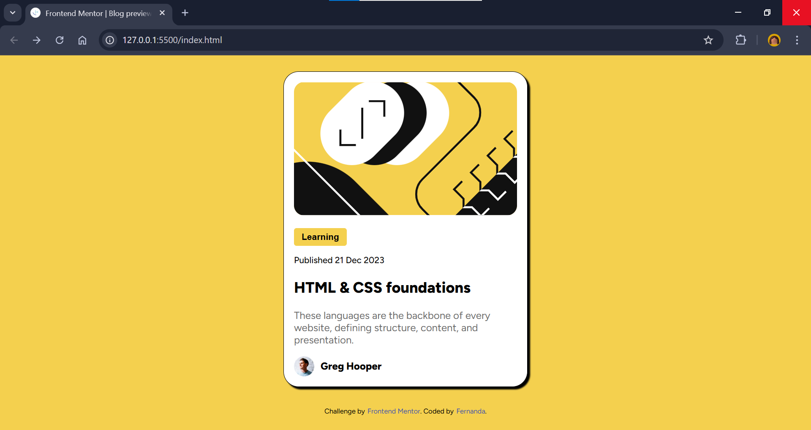

# Frontend Mentor - Blog preview card solution

This is a solution to the [Blog preview card challenge on Frontend Mentor](https://www.frontendmentor.io/challenges/blog-preview-card-ckPaj01IcS).

## Table of contents

- [Overview](#overview)
  - [Screenshot](#screenshot)
  - [Links](#links)
  - [Built with](#built-with)
- [Author](#author)

## Overview

This is my second challenge on the Frontend Mentor platform.

### Screenshot

### Links

- Solution URL: [https://github.com/fecroce/blog-preview-card.git]
- Live Site URL: [https://fecroce.github.io/blog-preview-card/]

### Built with

- Semantic HTML5 markup
- CSS custom properties
- Flexbox
- Mobile-first workflow

## Author

- Frontend Mentor - [@fecroce](https://www.frontendmentor.io/profile/fecroce)
